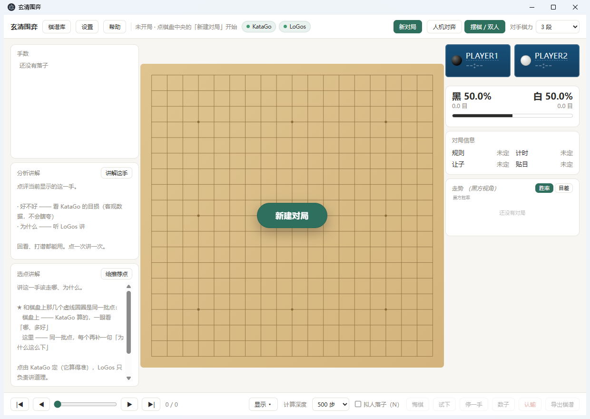
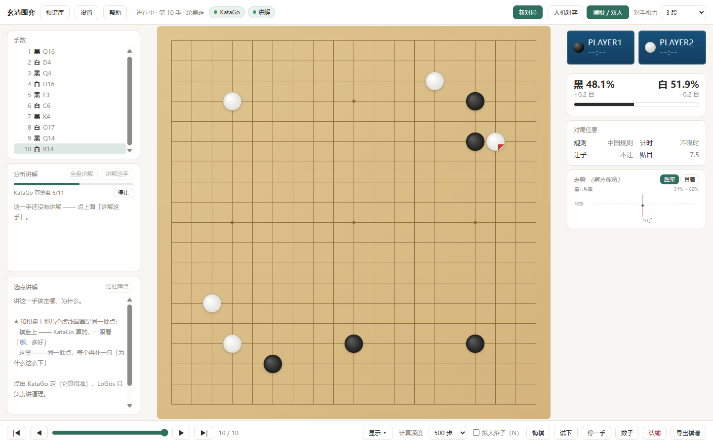
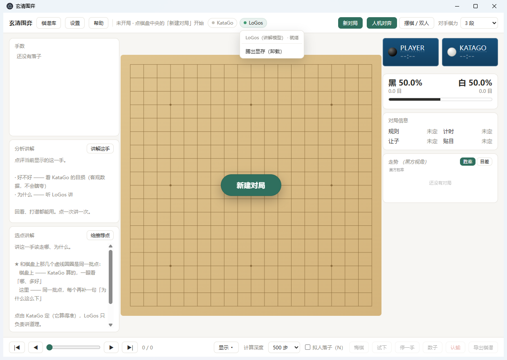
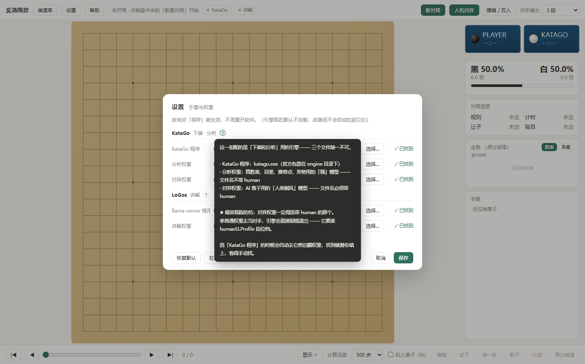

# RapaceGo (玄清围弈)

> A Windows desktop Go (weiqi) tool: **play against KataGo, read objective numbers,
> and hear a local language model explain the moves in plain Chinese.**
> Everything runs on your own machine — no cloud, no uploading your games.

[简体中文](README.md) · English

> ## 📥 [Download · installation steps (about 5 minutes)](README.en.md#option-1-download-the-ready-to-run-build-recommended)
>
> Windows 10 / 11 only. **If you don't want to read the whole thing, just click that link** —
> it starts at the download step and walks you through to a running app.



---

## What it is

The goal isn't "another Go GUI" — it's a narrow one: **after a game, know where you went wrong and why.**

So it pairs two things and keeps their roles strictly separate:

| Component | Role |
|---|---|
| **KataGo** (engine) | The numbers — winrate, score lead, candidate moves, territory, points lost per move. Objective, never flatters you. |
| **LoGos** (local 7B model) | The words — explains *why* a move was good or bad, and what the engine preferred at that moment. |

**Verdicts come from KataGo's numbers; explanations come from LoGos.**
This split is deliberate: tested against obviously bad moves, the language model happily
invents a justification for them. So it never gets to judge — only to explain.

---

## Features

**Play** — human-style opponents rated by amateur rank (20k–9d, plus "pre-AI era" and
"pro style by year"); handicap done the standard way; free-placement / two-player mode;
scratch-play ("what if") board; 9/13/19 lines; Chinese / Japanese / Korean / Ming-Qing rules;
5 time-control presets with byo-yomi beeps and **loss on time**.

**Numbers** — winrate bar & score, recommended moves, move previews, ownership map
(fog or blocks), winrate/score graph, per-move loss list, and a **review report**
(black/white split: average loss, blunder counts, agreement with AI's top choice).
Per-move numbers appear **only once the search has settled** (a "…" placeholder shows
while it is still computing), so a number never changes after you have seen it.

**Recovery** — a **Refresh** button next to the engine lamps in the top bar. If the
recommended moves stop appearing, or the "computing… N" line above the board freezes,
press it: it releases the stuck analysis, re-queues it, re-checks the engine, and
restarts the engine if it is actually dead.

**Explanation** — three panels, all powered by the local LoGos model:
- **Explain this move** — verdict from KataGo, reasoning from LoGos. Stored per move.
- **Explain candidates** — several recommended points, each explained.
- **Explain whole game** — narrates every move of an SGF once; **the result is saved
  next to the SGF**, so reopening it shows the commentary instantly.



**Game library** — import / export / rename / delete / search SGFs, with badges for
"reviewed" and "has commentary".

**Commentary stored inside the SGF** (many downloaded records carry it, especially pro games
and problem collections): the **Commentary** box (bottom right) shows the note for the move
you are looking at. Click **Edit** to change it and it is **written back into the original
file** (the first edit leaves a `.bak` backup).

- The block of text at the **very start** of a record (collection source, "diagram 55",
  who compiled it) shows up in the **“(before the game · notes)”** slot — go to the first
  move and it is there. It can be edited and saved back too.
- Only the one note you edited changes; everything else in the file stays byte-for-byte
  identical.
- **Blank lines inside commentary are collapsed**: pro commentary is usually one sentence
  per line, and the blank lines are leftovers from the exporting tool.
- For problem collections (one file holding several problems) the top bar shows
  **“problem N of M”** — it only *labels* the position, it does **not** jump between
  problems (that would touch the move range, engine requests, history and caches).

**Manual engine loading** — the app starts with **no engine loaded** (zero VRAM).
Click the indicator in the top bar when you want AI:



---

## Hardware requirements

**VRAM is the real constraint** — both KataGo and the commentary model live in it.

| | Minimum | Recommended |
|---|---|---|
| OS | **Windows 10 / 11 (64-bit)** | same |
| RAM | 8 GB | 16 GB |
| GPU | 4 GB VRAM (or integrated graphics — KataGo alone is fine) | **8 GB VRAM** (RTX 3060 / 4060 or better) |
| Disk | ~2 GB | ~8 GB (if you want the commentary model) |

> ### ⚠️ macOS users, read this first
>
> **This app is Windows-only and will not run on macOS.** (Not "untested" — not built:
> the engine paths, desktop shortcuts and process handling are all Windows-specific;
> a Mac build needs a real port.)
>
> - **Can you still use KataGo on a Mac?** Yes — KataGo itself supports macOS via the
>   Metal backend and installs natively on Apple Silicon with `brew install katago`.
>   It's **this GUI** that you can't use.
> - **Want a Go GUI on macOS?** Use another one with the same engine:
>   [KaTrain](https://github.com/sanderland/katrain),
>   [Lizzie](https://github.com/featurecat/lizzie),
>   [Sabaki](https://sabaki.yichuanshen.de/), or
>   [q5Go](https://github.com/bernds/q5Go).
> - **Want this app on your Mac?** Run Windows in a VM (Parallels/UTM), or remote
>   desktop into a Windows machine.
> - **Want a native Mac build?** Open an issue and say so — if there's demand I'll
>   schedule it.
>
> ### GPU brands (NVIDIA / AMD / Intel all work)
>
> The app doesn't care about your GPU brand, but **KataGo ships several
> mutually-incompatible builds** and the wrong one simply fails to start:
>
> | Your GPU | KataGo build (filename prefix) |
> |---|---|
> | **NVIDIA** | `cuda…` or `trt…` (fastest) |
> | **AMD** | `opencl…` (works on any brand), or `rocm7.13-gfx???…` (faster; match your GPU: RDNA2=`gfx103X`, RDNA3=`gfx110X`, RDNA3.5=`gfx1151`, RDNA4=`gfx120X`) |
> | **Intel iGPU / Arc** | `opencl…` or `onnx-openvino…` |
> | Any brand (cross-vendor) | `onnx-directml…` |
> | CPU only | `eigen…` / `eigenavx2…` |
>
> Unsure? Use `opencl` — it works on every brand, just a bit slower than a
> vendor-specific build. Then verify in
> **Settings → engine compatibility self-check → Check**, which reads the backend the
> engine reports and compares it against your GPU.
>
> ⚠️ **Honest note**: development and testing happen on an **NVIDIA RTX 4070**, so the
> **AMD / Intel paths are not machine-verified here**. The table above comes from
> KataGo's official release assets. If an AMD card still won't start after those steps,
> paste the self-check result into an issue.

Measured VRAM usage (RTX 4070 Laptop / 8 GB, read with `nvidia-smi`):

| Component | Usage |
|---|---|
| KataGo analysis engine (winrate, candidates, territory, review) | ≈ **350 MB** |
| KataGo play engine (AI moves) | ≈ **170 MB** |
| LoGos commentary model (Q4_K_M, 7B) | ≈ **4.9 GB** |
| **All three at once** | ≈ **5.5 GB** |

- **6 GB VRAM works**, but don't load all three at once (unload one first)
- **4 GB / integrated graphics**: KataGo features only — commentary will keep saying
  "commentary model not loaded"
- **To run all three at once you want 8 GB**

> This is exactly why the app **loads no engine at all by default** — if you're not using
> AI, nothing occupies VRAM. Click the indicator in the top bar when you need it, and
> unload when you're done.

**No discrete GPU?** KataGo can run CPU-only — slow, but playable. Download the `eigen`
build (`katago-v?…-eigen-windows-x64.zip`) and point **Settings → KataGo program** at it.

> ⚠️ There is **no "switch to CPU" toggle in Settings** — the panel only sets file paths.
> Which device is used is decided by **which build of `katago.exe` you put there**
> (see the GPU table above). The old README said "changeable in Settings"; that was wrong
> (fixed 2026-10-09).

The commentary model also runs on CPU but drops to a few characters per second, which is
effectively unusable.

---

## ⚠️ Neither the repo nor the download bundles the engines or the model

Only the application code is here (about 600 KB). To actually run it you must provide
your own copies — they are third-party projects with their own licenses:

| What | Where from | Put it at |
|---|---|---|
| **KataGo** binary | [lightvector/KataGo](https://github.com/lightvector/KataGo/releases) (Windows) | `<app>\KataGo\engine\katago.exe` |
| **KataGo weights** (two) | [katagotraining.org](https://katagotraining.org/) — one strong, one `human` | `<app>\KataGo\weights\*.bin.gz` |
| **llama.cpp** runtime | [ggml-org/llama.cpp](https://github.com/ggml-org/llama.cpp/releases), CUDA build (**the official zip does NOT bundle the CUDA runtime — grab the matching `cudart` zip too**) | `<app>\LoGos\llama-server.exe` |
| **LoGos-7B** weights | [YichuanMa/LoGos-7B](https://huggingface.co/YichuanMa/LoGos-7B), converted to GGUF (Q4_K_M ≈ 4.4 GB) | `<app>\LoGos\LoGos-7B-Q4_K_M.gguf` |

Lay them out like this and it just works (the app looks **next to itself**):

```
RapaceGo/
├─ RapaceGo.exe
├─ KataGo/
│  ├─ engine/katago.exe
│  └─ weights/b11c768nbt.bin.gz, b18c384nbt-humanv0.bin.gz
└─ LoGos/                        ← optional: skip it entirely if you don't want commentary
   ├─ llama-server.exe
   └─ LoGos-7B-Q4_K_M.gguf
```

> ### `.bin.gz` or plain `.bin`? **Both work.**
> `katagotraining.org` hands out gzipped weights (`.bin.gz`) — use them as-is, no unpacking.
> But some file hosts (Quark, for one) **refuse to share archives**, so people unzip the
> `.bin.gz` into a plain `.bin` before uploading. The app accepts **both** (tested: KataGo
> loads a plain `.bin` fine — it is just bigger, ~270 MB vs ~200 MB).
> If your downloaded weight doesn't show up in the file picker, its extension was probably
> mangled on the way — switch the dialog to "All files".

> **Already grabbed `LoGos-7B-Q4_K_M.gguf.part01 / .part02 / .part03` yourself?**
> Then the .bat is unnecessary — see the **▶ Click to expand** section just below,
> it merges them with one command.

<details>
<summary><b>▶ Click to expand: already downloaded the three .part files? Merge them yourself instead of using the .bat</b></summary>

If you grabbed `LoGos-7B-Q4_K_M.gguf.part01 / .part02 / .part03` from the Releases page,
join them into a single `LoGos-7B-Q4_K_M.gguf` (same folder). Either way works:

**① One line in the command prompt**

```bat
copy /b LoGos-7B-Q4_K_M.gguf.part01+LoGos-7B-Q4_K_M.gguf.part02+LoGos-7B-Q4_K_M.gguf.part03 LoGos-7B-Q4_K_M.gguf
```

**② PowerShell (streamed, low memory use)**

```powershell
$out = [System.IO.File]::Create("LoGos-7B-Q4_K_M.gguf")
foreach ($p in "part01","part02","part03") {
  $i = [System.IO.File]::OpenRead("LoGos-7B-Q4_K_M.gguf.$p")
  $i.CopyTo($out); $i.Close()
}
$out.Close()
```

**③ 7-Zip / WinRAR — no.** Archive tools have no "join split files" function.

**⚠️ Always check the result**: it should be **4,466,xxx,xxx bytes (about 4.36 GB)**.
If it's smaller, a part did not finish downloading — delete them and download again.
Then delete the three `.part` files to reclaim 4.4 GB, and point the app's Settings at
`llama-server.exe` and the merged `.gguf`.

> Why split files at all? GitHub refuses any single file over 2 GB, and this model is
> 4.4 GB. The parts are plain binary chunks — joining them reproduces the original file
> byte for byte (verified with sha256 during development).

</details>

**Just want to play, no commentary?** Prepare only the KataGo files — the commentary
features simply stay unused. Anywhere else works too: set it in the app's Settings, or
via the `RAPACEGO_KATAGO` / `RAPACEGO_LOGOS` environment variables.

### Option 1: download the ready-to-run build (recommended)

> ## ⬇️ [Go straight to the newest download list (Assets)](https://github.com/Rapace7/RapaceGo/releases/latest#assets)
>
> That link **always lands on the newest release** (no version number to remember), and drops
> you right at the file list. `RapaceGo.zip` in there is the one you want.

Grab it from the **[download list](https://github.com/Rapace7/RapaceGo/releases/latest#assets)** —
the link above always points at the newest release, so you never have to look up a version
number. (For the full history and changelogs, the
**[Releases page](https://github.com/Rapace7/RapaceGo/releases)** lists every version, newest
at the top.)

| File | Size | Notes |
|---|---|---|
| `RapaceGo.zip` | ~146 MB | unzip it once, then launch from the folder — **fastest startup** ⭐ |

That is the only download: the build ships as a single archive so that **everything lives
in one folder** — the engines, your game records, the settings. Copy that folder anywhere and
it still works; delete it and nothing is left behind.

Drop the two engine folders next to `RapaceGo.exe` and you're done.

> ✅ **Unzipping into a nested folder (e.g. `D:\Games\RapaceGo\RapaceGo\`) is fine.**
> The app looks for `KataGo/` and `LoGos/` in **the folder the .exe itself lives in**,
> so the path and the nesting depth do not matter — verified against the packaged build
> on 2026-10-09. The only requirement is that `KataGo/` sits in the **same folder**
> as `RapaceGo.exe`.

### Option 2: run from source (to change the code)

```
git clone https://github.com/Rapace7/RapaceGo.git
cd RapaceGo
npm install
start.bat            (double-click)
```

In source mode the engines go **one level above** the project folder, or you point at
them in Settings. `.npmrc` already carries Chinese mirrors so `npm install` is fast
domestically.

### Configure the paths

Open **Settings** (top-left) and point it at your files. Every field has a `?`
you can hover for what it is and where to find it:



> **The classic mistake**: the *opponent* weight must be the one with `human` in its
> filename. Using a normal weight there makes the engine exit immediately.

---

## Updating to a newer version

**In one sentence: unzip the new build over your existing folder and let it overwrite. Your
game records and settings are not touched.**

### Three steps

1. **Check which version you have** — open the app → **Help** (top-left) → the version is
   shown next to the title (e.g. `v0.1.10`).
   (The download is always named `RapaceGo.zip` **without** a version number, so the filename
   can't tell you what you have — this is the only way.)

2. **See if there's something newer** → <https://github.com/Rapace7/RapaceGo/releases>
   The **topmost entry is the latest**, with its version and date in the title.

3. **Close the app** → download the new `RapaceGo.zip` → **unzip it into the same folder**
   (choose your current folder as the destination; when Windows asks, pick "Replace the files
   in the destination") → double-click `RapaceGo.exe` again.

### Why nothing is lost

The archive contains **only the application** — none of your data:

| Yours | In the archive? | After updating |
|---|---|---|
| `records\` — your SGF files, review reports, move-by-move commentary | ❌ no | **kept as-is** |
| `settings.json` — the engine paths you configured | ❌ no | **kept as-is** |
| `KataGo\`, `LoGos\` — the engines and the commentary model | ❌ no | **kept as-is** |
| `userdata\` — app cache | ❌ no | kept (safe to delete, it gets rebuilt) |

> ⚠️ **Always close the app before updating.** While it's running the files are locked, so the
> overwrite fails or only partly completes — which looks like "still the old version after
> updating", or the app won't start at all. Wait a few seconds after closing the window.

### Belt and braces (optional)

Copy the **`records` folder** somewhere else before updating. It's the only thing that
**can't be recovered** if it's lost (your games and commentary); the app itself can always be
downloaded again from the Releases page.

### How the version numbers work

| Digit | When it goes up | Example |
|---|---|---|
| **third** | Bug fixes and small changes. **+1 on every release**, may be frequent | 0.1.0 → **0.1.1** → 0.1.2 |
| **second** | A new feature you can actually notice; only once a batch accumulates | 0.1.x → **0.2.0** |
| **first** | Only `1.0.0`: stable enough to recommend to anyone | |

No big jumps — every release only moves the third digit, so `0.1.1 → 0.1.2` just means
"another batch of fixes".

---

## Notes on the commentary

- **Speed**: about 2–4 s for a 150–200 character explanation on an RTX 4070 Laptop.
  A full 200-move game takes roughly 8–12 minutes, can be stopped, and **resumes**
  where it left off.
- **⚠️ The commentary is always in Chinese.** LoGos (a 7B model fine-tuned on
  Chinese-annotated Go data) only outputs Chinese — even when both the system prompt
  and the user prompt are in English, it still answers in Chinese. This isn't a setting
  we can flip.
  **The practical workaround**: the commentary is plain prose, so just **select it and
  paste it into any translation tool or LLM** (Google Translate, DeepL, ChatGPT, etc.).
  It translates cleanly, and Go terminology comes through fine.
- **It makes mistakes**: LoGos is a 7B model. It sometimes uses the wrong technical
  term (calling a star point a komoku, etc.). **Positions are usually right, names may be wrong.**
  Trust KataGo's numbers over its wording.
- "Explain whole game" ≠ "AI review": the review produces a *data report*,
  the commentary produces *per-move prose*.

---

## How this was built (human + AI agent)

**Nearly all of the code was written by an AI agent.** This project is an experiment
in long-running human–AI collaboration:

- **The human** sets direction, decides features, judges usability, accepts results.
- **The AI agent** (running on [WorkBuddy](https://www.workbuddy.cn/docs/workbuddy/Overview))
  writes the code, researches APIs, runs the tests, writes docs, fixes bugs.

The development conversations were powered by **DeepSeek V4.1 Flash**.

The whole process is recorded in **[开发记录.md](开发记录.md)** (Chinese) — not a changelog,
but a *decision log*: why each feature is the way it is, which approaches were rejected,
what broke, and the measured numbers behind each choice.

The `_*.mjs` / `_rtest.py` files in the repo root are the self-check suite:
static checks (DOM references, IPC contract, `[hidden]` collisions), end-to-end smoke tests,
and cross-game race regression. They run in seconds after every change.

---

## FAQ

**"How do I know if there's a newer version?"**
Settings → **关于与更新** → **检查更新**. It asks GitHub what the latest release is and compares
it with your build. The **去下载页** button next to it opens the latest release page in your browser
(it always points at the newest release).

**"Does this app need the internet? Does it phone home?"**
**Apart from that one update check, nothing here touches the network.** KataGo and LoGos are local
processes; the app talks to LoGos over **loopback** (127.0.0.1), so no data leaves your machine.
The update check fires **only when you click it** — no auto-check, no background calls, no telemetry.
If it can't reach GitHub it says so instead of pretending you're up to date.
(Enforced by `dev/_lint_net.mjs`, which fails if anything outside the update check reaches the net.)

**"Engine not found"?** Fix the paths in Settings — where the engines must go depends on
which build you are running:

- **The downloaded zip (packaged build)**: engines sit in **the same folder as `RapaceGo.exe`**
  (`KataGo/`, `LoGos/` as siblings of the exe). The path and the nesting depth do not matter.
- **Running from source**: engines go **one level above the project folder**
  (code in `D:\x\RapaceGo\` → engines in `D:\x\KataGo\`).
- **The all-in-one package (懒人包)**: already configured; if you still see this, open an Issue
  with a screenshot of the paths in Settings.

**"I can't see my downloaded weights in the file picker"?**
The app accepts **`.bin.gz` and `.bin`**. Some hosts (Quark) won't share archives, so people
unzip the weight into a plain `.bin` first — that works too, no need to re-zip it.
If the extension got mangled along the way (browser added `.zip`, or a `(1)` suffix),
switch the dialog's file type to "All files".

**"Commentary model not loaded"?** Click the `LoGos` indicator in the top bar → Load.
Not loading it by default is intentional (saves VRAM).

**llama-server is extremely slow (seconds per character)?**
It's probably running on CPU — the official Windows CUDA build ships **without** the
CUDA runtime. Run `llama-server.exe --list-devices`; if it prints `none`, download the
matching `cudart-*.zip` from the same llama.cpp release and drop the DLLs next to the exe.

**Recommended moves stopped showing, or the "computing… N" line above the board
freezes and nothing responds?**
Click **Refresh** next to the engine lamps in the top bar. It releases the stuck
analysis, re-queues it, re-checks the engine, and restarts the engine if it is dead.

**Why does the move I just played show "…" instead of a number?**
It is still computing. Numbers appear **only once the search has settled, and never
change after that** — on purpose: the engine reports partial results every 0.25 s, and
showing those would make the same number jump around. Lower "search depth" in the bottom
bar if you want numbers sooner.

**Where are my games?** In `records\` next to the app.

**Can I redistribute it bundled with the model?** Please don't — LoGos is licensed for
research / non-commercial use only, and 4.4 GB doesn't travel well anyway.

---

## License & credits

This project's code: **MIT** (see [LICENSE](LICENSE)).

It depends on excellent open-source work, each under its own license:

- [KataGo](https://github.com/lightvector/KataGo) — the engine (MIT).
- [LoGos / InternThinker-Go](https://huggingface.co/YichuanMa/LoGos-7B) (Shanghai AI Lab) —
  the explaining model. ⚠️ Its model card says Apache-2.0, but the project README states
  the data is **CC BY-NC 4.0, research use only** — **treat it as non-commercial.**
- [llama.cpp](https://github.com/ggml-org/llama.cpp) — inference runtime (MIT).
- [Electron](https://www.electronjs.org/) — desktop shell (MIT).

The UI, rules engine, SGF I/O and the commentary pipeline are original code in this repo.
